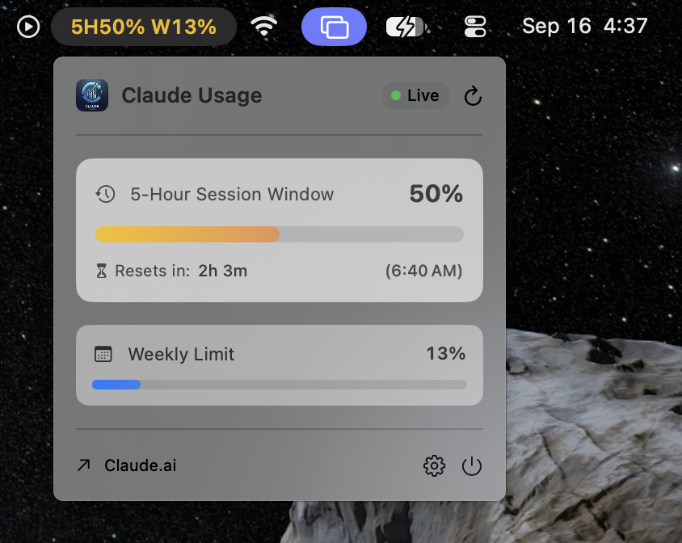

# ClaudeUsageBar

A tiny macOS menu bar app that shows your live Claude Code CLI usage — 5-hour and 7-day usage — right in the menu bar.

<p align="center">
  
</p>

It works by reading a small JSON snapshot file that a Claude Code CLI `statusLine` hook writes on every prompt. ClaudeUsageBar doesn't call any API itself; it just displays what Claude Code CLI already reports.

<p align="center">
  
</p>

## Features

- Menu bar text showing 5h / 7d usage percentages
- Color-coded text: green (<50%), amber (50–89%), red (89%+)
- Popover with more detail (context window usage, spend limit, last captured time)
- Configurable background refresh interval
- Runs as a pure menu bar item (no Dock icon)

## Requirements

- macOS 14.0 or later
- [Claude Code CLI](https://code.claude.com/docs/en/quickstart#step-1-install-claude-code), installed and logged in
- `jq` (ships with recent macOS; otherwise `brew install jq`)

## Install

1. Install the Claude Code CLI and log in, if you haven't already.
2. Run the hook installer:
   ```
   ./install-usage-hook.sh
   ```
   This wires a `statusLine` hook into `~/.claude/settings.json` that captures usage data to `~/.claude/usage-snapshot.json` on each Claude Code CLI prompt. It's safe to re-run and merges into your existing settings without overwriting unrelated keys.
3. Open the Claude Code CLI once so the hook fires and the snapshot file is created.
4. Copy `ClaudeUsageBar.app` into your `/Applications` folder.
5. Remove the quarantine flag (since the app isn't notarized):
   ```
   sudo xattr -d com.apple.quarantine /Applications/ClaudeUsageBar.app
   ```
6. Open `ClaudeUsageBar.app`.

If you open the app before step 3, it will just say "File not found… make sure the Claude Code statusLine hook is configured." — nothing is broken. Run the installer late and reopen Claude Code CLI, and the snapshot file will appear within a few seconds.

## How it works

- `install-usage-hook.sh` installs `~/.claude/hooks/usage-snapshot.sh` and points Claude Code CLI's `statusLine` setting at it.
- On each Claude Code CLI invocation, that hook reads the statusline JSON payload from stdin, extracts `rate_limits.five_hour`, `rate_limits.seven_day`, `spend_limit`, and `context_window.used_percentage`, and writes them to `~/.claude/usage-snapshot.json`.
- `ClaudeUsageBar.app` polls that file and renders the values in the menu bar.

## Uninstall

- Quit ClaudeUsageBar and delete `/Applications/ClaudeUsageBar.app`.
- Remove the hook and revert the statusline setting: delete `~/.claude/hooks/usage-snapshot.sh` and the `statusLine` entry in `~/.claude/settings.json` (a timestamped backup of your prior `settings.json` was created by the installer, e.g. `settings.json.bak-YYYYMMDD-HHMMSS`).
